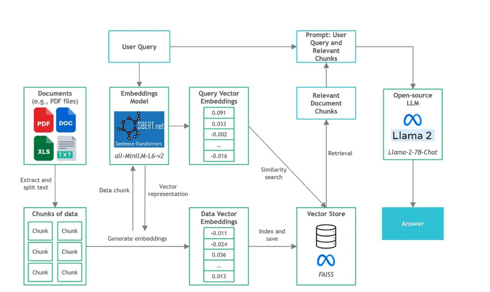
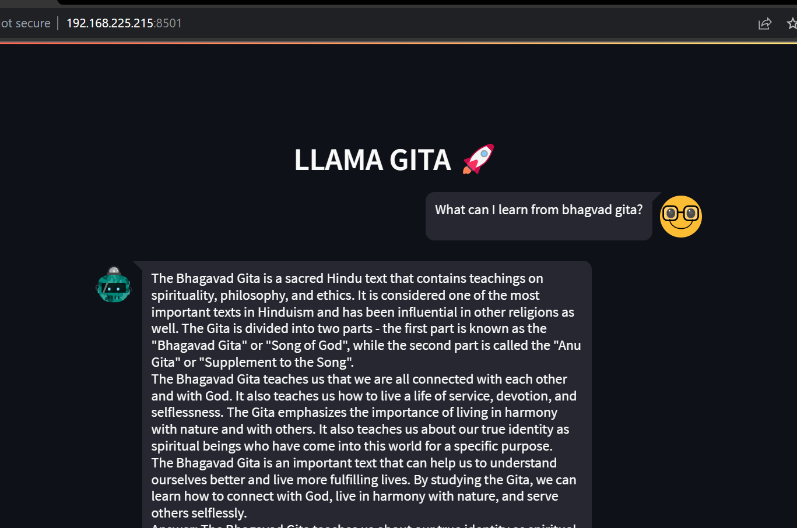
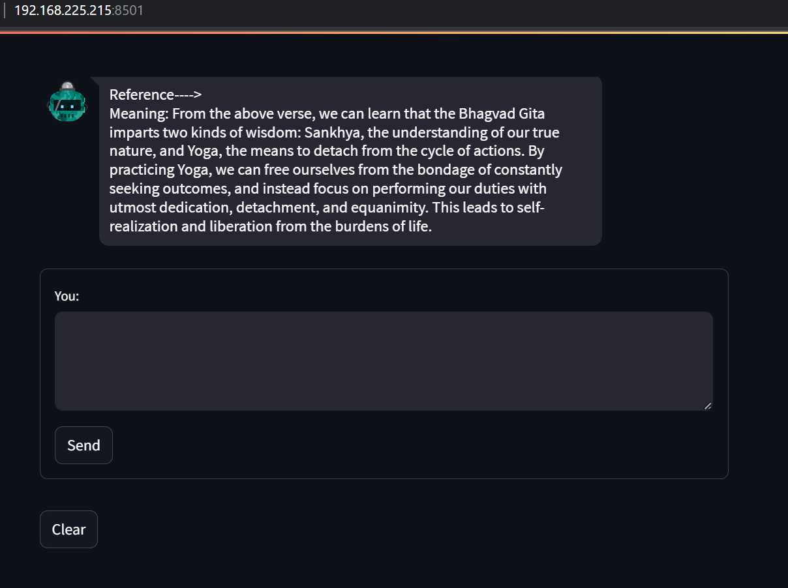
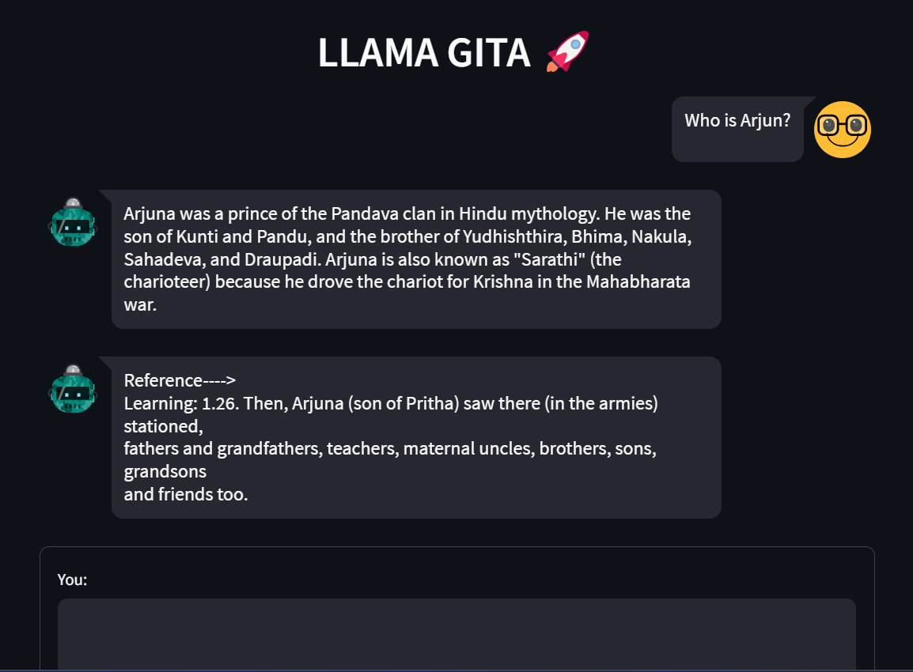

## Directory structure

```
LAMMAGITA/
├── data/
│   ├── Bhagwad_Gita.csv: This dataset was downloaded from Kaggle.
│   ├── dataset.csv: Processed dataset.
├── models/
│   ├── llama-2-7b.ggmlv3.q4_0.bin: Quantized LLM 2 model.
├── src/
│   ├── llm.py: This file contains the initial LLM configuration.
│   ├── prompt.py: It contains the prompts used for model inference.
│   ├── utils.py: This sets up the connection to VectorDB for inference.
├── vectorstore/ : This directory contains files related to the vector database.
├── custom_dataset.py: This script processes data from Bhagwad_Gita.csv and creates dataset.csv.
├── db_build.py: This script builds the vector database for similarity search.
├── main.py: This file contains the user interface for the chatbot created using Streamlit.
├── process_dataset.py: This script further processes the dataset.
└── README.md: This file provides information on the directory structure and instructions for running the project.
└── requirement.txt: It contains a list of Python packages or libraries along with their version numbers. These packages are dependencies that are required for a Python project to run.
└── run_llama_gita.sh: bash script with instructions to run the container.
```
## Tools and Data



### Software Tools Utilized in Building the Backend Application

1. **LangChain**: LangChain is a widely-used framework for developing applications powered by language models.

2. **C Transformers**: C Transformers is a Python library that offers bindings for transformer models implemented in C/C++ using the GGML library.

3. **Sentence-transformers**: Sentence-transformers is a Python library that provides easy methods to compute embeddings (dense vector representations) for sentences, text, and images.

4. **FAISS**: FAISS is a library designed for efficient similarity search and clustering of dense vectors.

5. **Streamlit**: Streamlit is a free and open-source framework to rapidly build and share beautiful machine learning and data science web apps.

### Dataset

[Link to the Bhagavad Gita Dataset](https://www.kaggle.com/datasets/a2m2a2n2/bhagwad-gita-dataset)

This dataset was used to provide context to the Llama 2 model and was further modified to have columns for meaning and learning for each Sanskrit shloka.

### Models

**Model Used:** [llama-2-7b.ggmlv3.q4_0.bin](https://huggingface.co/TheBloke/Llama-2-7B-GGML)

**Model Type (Llama 2):** It is an open-source model supported in the C Transformers library.

**Model Size (7B):** Given that we are performing document Q&A, the LLM is most suitable.

**Quantized Format (4-bit):** Given that the RAM is constrained to 8GB, the 4-bit GGML version is suitable as it only requires a memory size of 5.6GB. Smaller quantized formats come at the expense of accuracy and response quality.

## Approach

### Step 1: Process Data and Build Vector Store

- Data ingestion and splitting text into chunks
- Load embeddings model (sentence-transformers)
- Index chunks and store in FAISS vector store

After running the Python script `db_build.py`, the vector store will be generated and saved in the local directory named 'vectorstore/db_faiss,' ready for semantic search and retrieval.

### Step 2: Set Up Prompt Template

Utilized a classic prompt template.

### Step 3: Download the Llama-2–7B-Chat GGML Binary File

Here we are running the LLM locally; we need to download the binary file of the quantized Llama-2–7B-Chat model from [TheBloke’s Llama-2–7B-Chat GGML page](https://huggingface.co/TheBloke/Llama-2-7B-GGML) hosted on Hugging Face. Download the GGML 4-bit quantized file named `llama-2-7b-chat.ggmlv3.q3_0.bin`.

### Step 4: Set Up LLM

Leverage the integration between C Transformers and LangChain. Specifically, we will use the C Transformers LLM wrapper in LangChain, which provides a unified interface for the GGML models. Host configuration settings for the LLM can be defined, such as maximum new tokens, top k value, temperature, and repetition penalty.

### Step 5: Build and Initialize RetrievalQA

With the prompt template and C Transformers LLM ready, we wrote three functions to build the LangChain RetrievalQA object that enables us to perform document Q&A.

### Step 6: Combining into the Main Script

In the next step, we combined the previous components into the `main.py` script. To evaluate the speed of CPU inference, the timeit module is also utilized.

## User Interface

### User query: What can I learn from Bhagvad Gita?




### User query: Who is Arjun?


Here, the chatbot also indicates the source of the information in its response.
 
## Improvements
The application's performance and capabilities can be significantly enhanced by adopting a full-scale Llama 7B model, as opposed to the quantized version currently in use. Additionally, optimizing the deployment strategy by hosting the model remotely can substantially reduce inference time and improve overall responsiveness.

Furthermore, to enrich the user experience and provide more comprehensive insights, it is advisable to employ a more extensive and diverse dataset. This enhanced dataset should include the Sanskrit shlokas but also incorporate their English translations and guidance on addressing user queries effectively. 

## Limitations
One of the limitations associated with the current approach lies in the context limit imposed by the model, which stands at 512 tokens. This constraint occasionally leads to situations where the input surpasses the prescribed token limit, necessitating manual intervention to terminate the process. This interruption can disrupt the user experience and necessitate additional oversight during execution.

## To execute the application, any of the following methods can be employed:

### Approach 1: Commands to run
Command to `build` a docker image: `docker build -t llama-gita .`

Command to `run` a docker image: `docker run --rm -it -d -p 8501:8501 --name llama-gita-container llama-gita`

If all operations proceed without any issues, you can make inquiries to the chatbot at: http://192.168.225.215:8501/

### Approach 2: Running using bash script: `run_llama_gita.sh`

Make the script executable by running the following command: `chmod +x run_llama_gita.sh`
